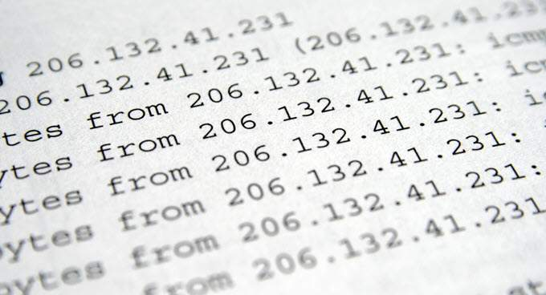
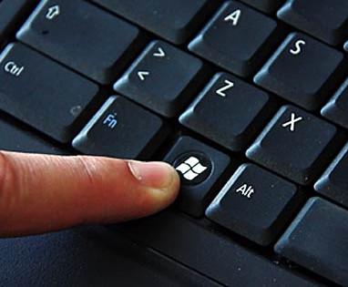
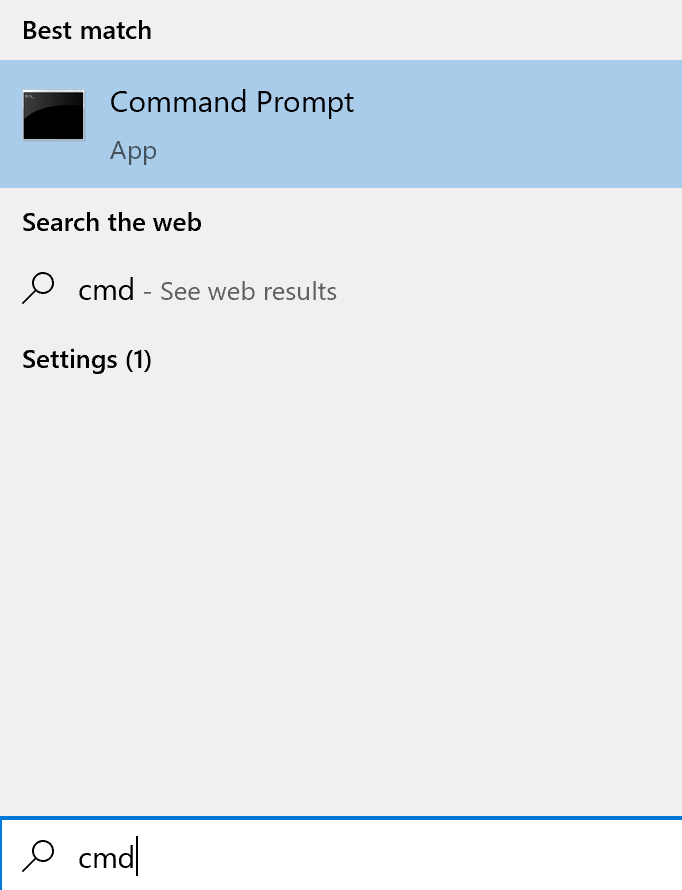

#               Welcome to my tutorial!

### My name is Mike Schmitt, and I am going to teach you some basic things about IP Addresses. Here are some things will go over.

* What is an IP address
* How to see what your IP address is on your Windows Machine
* How to change your IP address
 

#### What is an IP address?
1. An IP address is a number assigned to a specific device that allows it to communicate with other devices across the world.
   * Every device that connects to the internet has an IP address
   * The two types of IP addresses are IPv4 which looks like 172.16.1.1 and IPv6 which looks like 2001:0db8:85a3:0000:0000:8a2e:0370:7334.
2. An IP address is not permanently assigned to one device, meaning a your laptop might have an IP address of 192.168.110.57 one day, another day it could be 96.40.206.96.
3. The possible ranges for IPv4 addresses is 1.0.0.1 to 254.255.255.254
   * That means there are around 4.3 billion different IPv4 Ip addresses
   * We are beginning to use up all of those addresses which is why IPv6 was created
  
#### Viewing your IP address
##### Now that you have some basic information on what an IP address is, let's look at what yours is!
###### To view your IP address in Windows 10 follow these basic steps
1. Hit the windows key on your Keyboard
  
2. Type in "cmd"
  * This opens up your computer's terminal, which is basically another way you can navigate around your computer
  
3. Once in the Terminal type in the command "ipconfig"
###### To view your IP address on a MAC follow these basic steps
1. Navigate to the launchpad application
2. Once in the launchpad, type in terminal
3. Once in terminal type in the command "ifconfig"

